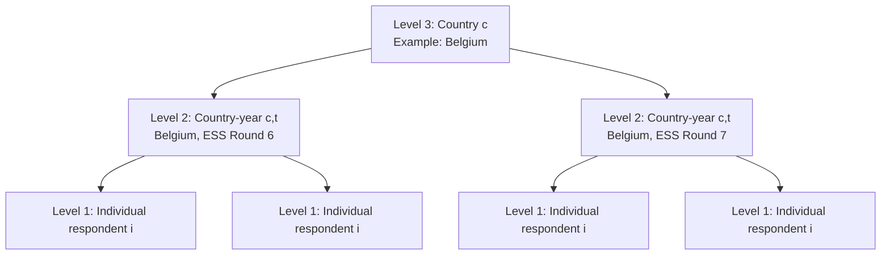
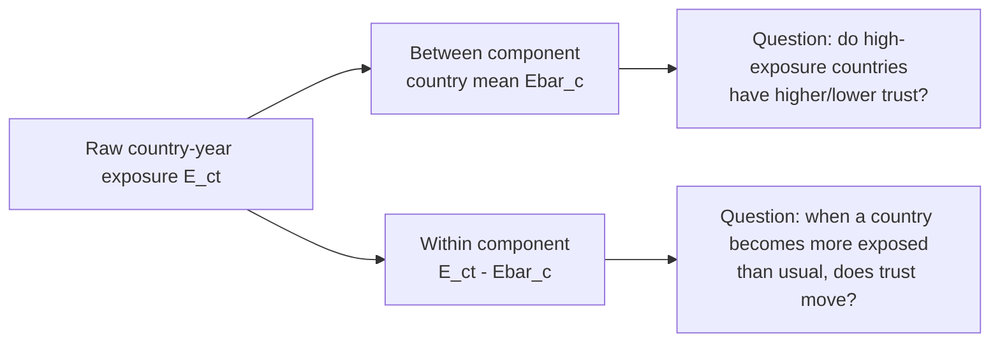
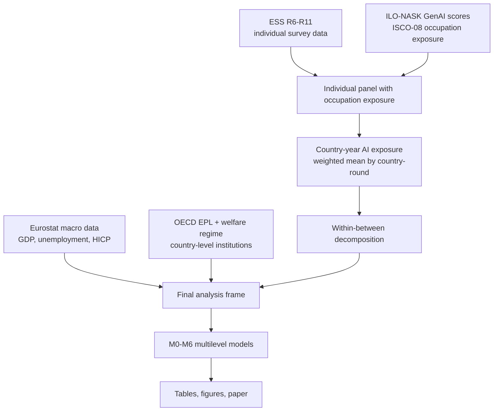
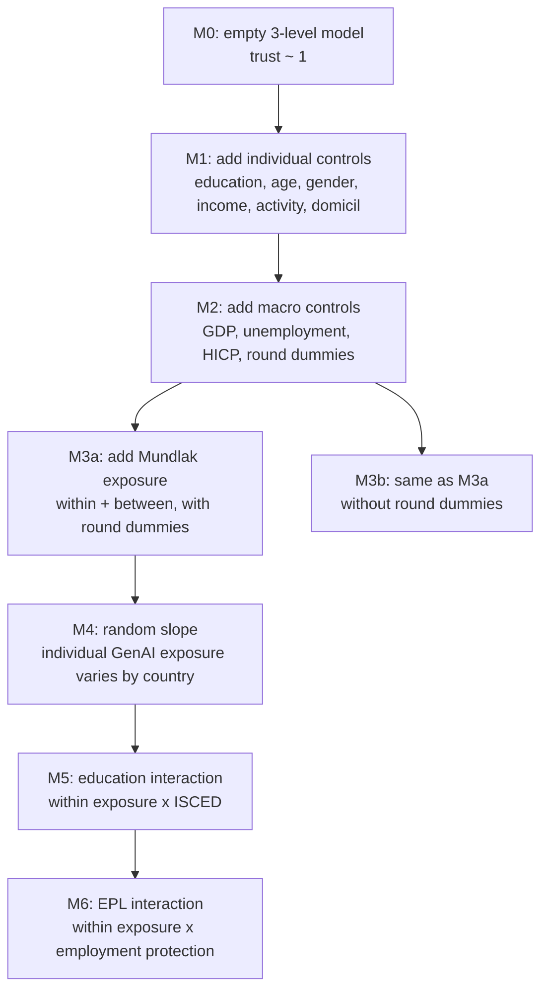
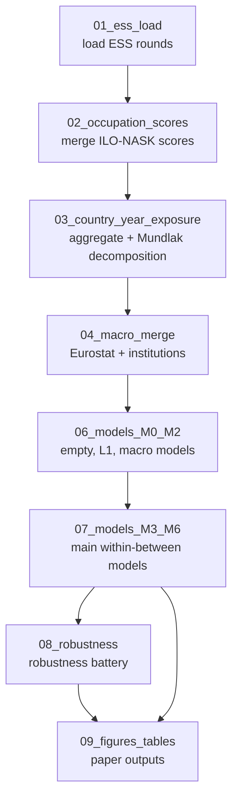

# Paper Explanation

This file explains the paper and the codebase from first principles. It is
written for someone with a technical background who has not yet studied
multilevel models, pooled cross-national survey data, or the specific project.

The project asks a simple substantive question:

> Do countries, country-years, or individuals with higher occupational exposure
> to generative AI also show lower institutional trust?

The hard part is that this one sentence hides several different questions:

- Are high-AI-exposure **countries** different from low-AI-exposure countries?
- Do changes in AI exposure **within the same country over time** predict
  changes in trust?
- Do **individuals** in AI-exposed occupations report lower trust than otherwise
  similar individuals?
- Do those patterns differ by education or labor-market institutions?

The paper's central methodological move is to separate those questions instead
of letting one coefficient mix them together.

---

## Table of Contents

1. [One-Minute Summary](#one-minute-summary)
2. [The Big Idea in Plain Language](#the-big-idea-in-plain-language)
3. [The Data Structure: Individuals, Country-Years, Countries](#the-data-structure-individuals-country-years-countries)
4. [Within-Country vs Between-Country: The Core Concept](#within-country-vs-between-country-the-core-concept)
5. [What the Paper Studies](#what-the-paper-studies)
6. [Theory and Hypotheses](#theory-and-hypotheses)
7. [Data Sources](#data-sources)
8. [Variable Construction](#variable-construction)
9. [The Mundlak / Within-Between Decomposition](#the-mundlak--within-between-decomposition)
10. [The Three-Level Multilevel Model](#the-three-level-multilevel-model)
11. [Model Sequence M0 to M6](#model-sequence-m0-to-m6)
12. [Inference: Standard Errors, Wald Tests, REML, and Caveats](#inference-standard-errors-wald-tests-reml-and-caveats)
13. [Codebase Walkthrough](#codebase-walkthrough)
14. [Notebook Pipeline](#notebook-pipeline)
15. [Robustness Checks](#robustness-checks)
16. [How to Interpret the Main Results](#how-to-interpret-the-main-results)
17. [Common Pitfalls and Why the Code Avoids Them](#common-pitfalls-and-why-the-code-avoids-them)
18. [Glossary](#glossary)
19. [Helpful Links](#helpful-links)

---

## One-Minute Summary

The paper uses European Social Survey data from rounds 6 to 11, covering 2012
to 2024. Each respondent has an occupation code. The code joins those occupation
codes to ILO-NASK generative-AI exposure scores. Individual exposure scores are
then aggregated to country-year averages.

The key variable is therefore:

```text
Average GenAI occupational exposure in country c at ESS round t
```

The paper decomposes that country-year average into two parts:

```text
country-year exposure = country average exposure + deviation from that country's average
```

In symbols:

```text
E_ct = E_c_between + E_ct_within
```

or, using the paper notation:

```text
E_ct = Ebar_c + (E_ct - Ebar_c)
```

The result is:

- The **between-country** association is large and positive:
  high-AI-exposure countries have higher institutional trust.
- The **within-country** association is basically zero:
  when a country becomes slightly more AI-exposed over time, trust does not
  detectably move with it.
- A Wald test rejects the idea that the within and between coefficients are the
  same.

Substantively, this means the cross-national correlation is probably not an AI
shock effect. It is more likely that high-exposure countries are already richer,
more service-based, more educated, and more institutionally trusted.

---

## The Big Idea in Plain Language

Suppose you compare two countries:

- Country A has many software developers, analysts, researchers, and managers.
- Country B has more manual, agricultural, or industrial occupations.

Country A will probably have higher measured GenAI exposure because GenAI tools
affect many white-collar tasks. Country A may also have higher institutional
trust because it is richer and has stronger institutions.

If we only compare Country A and Country B, we might conclude:

```text
More AI exposure is associated with more trust.
```

But that does not mean AI exposure caused trust. It may only mean:

```text
Richer service economies have both more AI-exposed occupations and higher trust.
```

Now ask a different question:

> When Country A becomes slightly more AI-exposed between 2012 and 2024, does
> Country A's trust change?

That is the **within-country** question. It compares a country to itself over
time.

This paper's headline finding is exactly that distinction:

```text
Between countries: high exposure and high trust go together.
Within countries over time: exposure changes do not move trust detectably.
```

That distinction is the reason the paper uses a Mundlak / within-between
multilevel model.

---

## The Data Structure: Individuals, Country-Years, Countries

The project has a three-level structure.



The levels are:

| Level | Unit | Example | Main variables |
|---|---|---|---|
| Level 1 | Individual | Respondent in Belgium, round 11 | Trust, occupation, education, age, gender, income |
| Level 2 | Country-year | Belgium in ESS round 11 | Average AI exposure, GDP growth, unemployment, inflation |
| Level 3 | Country | Belgium | Employment protection legislation, welfare regime |

Why this matters:

- People in the same country tend to be more similar than people in different
  countries.
- People in the same country-year share common context: the same macroeconomy,
  the same survey period, the same political climate.
- Ignoring this nesting makes uncertainty look smaller than it really is.

The multilevel model accounts for this by allowing:

```text
trust = overall average
      + country-specific deviation
      + country-year-specific deviation
      + individual residual
```

---

## Within-Country vs Between-Country: The Core Concept

This is the most important concept in the paper.

### A tiny example

Imagine three countries observed in three rounds:

| Country | Round 1 exposure | Round 2 exposure | Round 3 exposure | Country average |
|---|---:|---:|---:|---:|
| A | 0.20 | 0.22 | 0.24 | 0.22 |
| B | 0.30 | 0.31 | 0.32 | 0.31 |
| C | 0.40 | 0.41 | 0.43 | 0.413 |

The **between-country** part is each country's average:

```text
A between = 0.22
B between = 0.31
C between = 0.413
```

That captures stable differences between countries.

The **within-country** part is each round's deviation from the country's own
average:

| Country | Round | Exposure E_ct | Country mean Ebar_c | Within E_ct - Ebar_c |
|---|---:|---:|---:|---:|
| A | 1 | 0.20 | 0.22 | -0.02 |
| A | 2 | 0.22 | 0.22 | 0.00 |
| A | 3 | 0.24 | 0.22 | +0.02 |
| B | 1 | 0.30 | 0.31 | -0.01 |
| B | 2 | 0.31 | 0.31 | 0.00 |
| B | 3 | 0.32 | 0.31 | +0.01 |

The within part answers:

> Is this country above or below its own usual exposure level in this round?

The between part answers:

> Is this country usually more or less AI-exposed than other countries?

### Why one combined coefficient is dangerous

If you put only `E_ct` into a model, the coefficient mixes both:

```text
E_ct = between-country differences + within-country changes
```

That single coefficient answers a blurred question:

> What is the association between exposure and trust, mixing country-level
> differences with changes over time?

The paper does not want that. It wants the two separate questions.

### Visual intuition



---

## What the Paper Studies

### Outcome: institutional trust

The dependent variable is a trust composite built from three ESS items:

- `trstprl`: trust in parliament
- `trstlgl`: trust in the legal system
- `stfdem`: satisfaction with democracy

The code standardises each item globally and then averages them.

Why standardise?

The three items are all on 0-10 scales, but their means and variances differ.
Z-standardisation puts them on comparable units:

```text
z = (x - item_mean) / item_standard_deviation
```

The resulting trust composite is approximately in standard-deviation units.

Important detail:

The code standardises **per item globally across the pooled panel**, not within
each country-year. This is deliberate. If we standardised within each
country-year, we would remove the country and country-year differences the
multilevel model is supposed to explain.

Implemented in:

- [`src/mla/models.py`](src/mla/models.py), function `build_trust_composite`

### Main explanatory variable: GenAI occupational exposure

Each ESS respondent has an ISCO-08 occupation code. The project joins that code
to ILO-NASK GenAI exposure scores.

The paper uses two vintages:

- 2023 score for ESS R6-R10
- 2025 score for ESS R11

The reason is that generative AI capabilities changed sharply after the public
release and diffusion of GPT-4-era systems. The vintage rule tries to capture
that capability shift.

Implemented in:

- [`src/mla/exposure.py`](src/mla/exposure.py), function `assign_vintage_score`

### Main question

The paper asks:

```text
Does institutional trust vary with GenAI exposure at the individual,
country-year, and country levels?
```

The answer differs by level:

- Individual-level exposure: small positive coefficient, not the expected
  negative "loser" pattern.
- Country-year within exposure: near zero.
- Country-level between exposure: large positive association.

---

## Theory and Hypotheses

The theory section combines three literatures.

### 1. Performance theories of trust

Basic idea:

> People trust institutions more when they believe institutions perform well.

If AI creates job insecurity or makes institutions look unable to manage
economic change, trust might decline.

Technical role in the paper:

- Motivates the outcome: institutional trust.
- Connects labor-market change to political attitudes.

### 2. Structural grievance / loser theory

Basic idea:

> Technological change creates winners and losers. Losers may become more
> politically dissatisfied.

In robot-exposure studies, automation exposure often predicts populist voting
or lower political trust.

Technical role in the paper:

- Motivates a negative expected coefficient for individual exposure.
- Motivates a negative expected within-country coefficient.

### 3. Robot exposure and political behavior

Prior empirical literature often studies industrial robots, manufacturing, or
local labor markets. GenAI is different because it is more relevant to
white-collar, service, cognitive, and communication tasks.

Technical role in the paper:

- Provides a baseline expectation.
- The paper tests whether that robot-exposure pattern generalises to GenAI.

### Hypotheses in plain language

| Hypothesis | Technical version | Plain-language meaning |
|---|---|---|
| H1 | `gamma_B < 0` | Countries with higher average AI exposure should have lower trust. |
| H2 | `gamma_W < 0` | When a country becomes more AI-exposed over time, trust should decline. |
| H2a | `gamma_W != gamma_B` | The within and between effects may differ. |
| H3 | `beta_genai < 0` | Individuals in AI-exposed jobs should report lower trust. |
| H4 | within exposure x education | The within effect may differ by education. |
| H5 | within exposure x EPL | Employment protection may buffer the within effect. |

What happened empirically:

- H1 was falsified: `gamma_B` is positive, not negative.
- H2 was not supported: `gamma_W` is near zero.
- H2a was supported: within and between differ.
- H3 was not supported: individual exposure is small and positive.
- H4 returns a null interaction in the main sample.
- H5 is inconclusive because the EPL sample has only 22 countries.

---

## Data Sources

The project combines individual survey data, occupation scores, macroeconomic
data, and country-level institutional data.



### European Social Survey

ESS gives the individual-level survey data.

Used rounds:

- R6: 2012
- R7: 2014
- R8: 2016
- R9: 2018
- R10: 2021
- R11: 2023-2024

Important columns:

| Column | Meaning |
|---|---|
| `cntry` | Country code |
| `essround` | ESS round |
| `idno` | Respondent ID |
| `pspwght` | Post-stratification/design-related weight used for aggregation |
| `pweight` | Population weight, retained but not central in MixedLM |
| `trstprl`, `trstlgl`, `stfdem` | Trust outcome items |
| `isco08` | Occupation code |
| `eisced` | Education |
| `hinctnta` | Household income decile |
| `agea`, `gndr`, `mnactic`, `domicil` | Individual controls |

Implemented in:

- [`src/mla/ess_io.py`](src/mla/ess_io.py)
- [`notebooks/01_ess_load.ipynb`](notebooks/01_ess_load.ipynb)

### ILO-NASK GenAI scores

The score table gives exposure by 4-digit ISCO-08 occupation.

Example:

```text
ISCO 2512 = software developers
```

The code matches each respondent's `isco08` to a score:

```text
respondent occupation -> occupation exposure score
```

Then it computes country-year means:

```text
all respondents in Belgium, R11 -> weighted average AI exposure
```

Implemented in:

- [`src/mla/exposure.py`](src/mla/exposure.py)
- [`notebooks/02_occupation_scores.ipynb`](notebooks/02_occupation_scores.ipynb)

### Eurostat macro data

The macro controls are:

| Variable | Eurostat dataset | Meaning |
|---|---|---|
| `gdp_growth` | `nama_10_gdp` | Real GDP growth |
| `unemp_rate` | `une_rt_a` | Annual unemployment rate, ages 15-74, both sexes |
| `hicp_inflation` | `prc_hicp_aind` | HICP inflation |

These are country-year controls. They help avoid attributing broad economic
conditions to AI exposure.

Implemented in:

- [`src/mla/macro.py`](src/mla/macro.py)
- [`notebooks/04_macro_merge.ipynb`](notebooks/04_macro_merge.ipynb)

### OECD EPL

EPL means Employment Protection Legislation. It measures how strict employment
protection rules are. The paper uses a pre-period 2007 baseline, so the
institutional moderator predates the AI exposure period.

Why use a pre-period value?

Because if the EPL index were measured after AI diffusion, AI could itself have
affected labor regulation. A pre-period value is less vulnerable to reverse
causality.

Implemented in:

- [`src/mla/institutions.py`](src/mla/institutions.py)

---

## Variable Construction

### Trust composite

Raw trust items include valid values from 0 to 10 and sentinel values such as
77, 88, 99, or other values above 10.

The code:

1. Coerces invalid values outside 0-10 to missing.
2. Z-standardises each item globally.
3. Averages the available standardised items row by row.

Pseudo-code:

```python
for item in ["trstprl", "trstlgl", "stfdem"]:
    valid = item.where(item.between(0, 10))
    z_item = (valid - valid.mean()) / valid.std()

trust = mean(z_trstprl, z_trstlgl, z_stfdem)
```

Why row-wise mean?

If one item is missing but the others are present, the respondent can still
contribute information. This avoids unnecessarily dropping respondents with
one missing trust item.

### Individual exposure

The individual exposure score is:

```text
genai_i = exposure score for respondent i's ISCO-08 occupation
```

Rows with unmatched occupation codes get `NaN`.

Important unmatched cases:

- ESS sentinel occupation codes
- Missing occupations
- Occupations outside the ILO-NASK 427-code table

### Vintage rule

The project has two occupation score vintages:

```text
R6-R10 -> score_2023
R11    -> score_2025
```

This is implemented by:

```python
VINTAGE_FOR_ROUND = {
    6: 2023,
    7: 2023,
    8: 2023,
    9: 2023,
    10: 2023,
    11: 2025,
}
```

Why this matters:

- If every occupation had one fixed score forever, within-country exposure
  could only change because the country's occupational composition changed.
- The 2023 to 2025 vintage shift adds technology-capability variation.
- The robustness check using 2025 scores throughout asks whether the result is
  driven by that vintage shift.

### Country-year exposure

For each country-round cell, the paper computes:

```text
weighted mean of individual GenAI exposure
```

Formula:

```text
E_ct = sum_i(w_i * E_i) / sum_i(w_i)
```

where:

- `E_i` is individual occupation exposure.
- `w_i` is the ESS weight `pspwght`.
- The sum is over respondents in country `c`, round `t`.

Implemented in:

- [`src/mla/mundlak.py`](src/mla/mundlak.py), function `country_year_aggregate`

### Leave-one-out exposure

The leave-one-out version computes the same country-year mean but excludes the
current respondent:

```text
E_ct^(-i) = average exposure in respondent i's country-year cell, excluding i
```

Why?

The country-year exposure includes each respondent's own occupation. That can
create a mechanical correlation between:

```text
individual genai_i
country-year exposure E_ct
```

The leave-one-out check removes that mechanical self-contribution.

Implemented in:

- [`src/mla/mundlak.py`](src/mla/mundlak.py), function
  `country_year_aggregate_leave_one_out`

Important technical detail:

The fixed version gates weights on both valid value and valid weight. A
respondent with missing exposure but positive weight must not inflate the
denominator for everyone else in the cell.

---

## The Mundlak / Within-Between Decomposition

The Mundlak decomposition is the paper's methodological core.

Start with country-year exposure:

```text
E_ct
```

For each country, compute the country mean:

```text
Ebar_c = average of E_ct across rounds for country c
```

Then compute the deviation:

```text
E_ct_within = E_ct - Ebar_c
```

Now the identity holds:

```text
E_ct = Ebar_c + (E_ct - Ebar_c)
```

In code:

```python
out[value_col + "_between"] = groupby_country_mean
out[value_col + "_within"] = out[value_col] - groupby_country_mean
```

Implemented in:

- [`src/mla/mundlak.py`](src/mla/mundlak.py), function `within_between_decompose`

### Why it is called "Mundlak"

Yair Mundlak showed that adding group means of time-varying variables lets a
random-effects model recover the within effect while still estimating between
effects. In modern multilevel language, this is often called:

- Mundlak model
- within-between random-effects model
- correlated random-effects model
- hybrid model

### What the coefficients mean

The model includes both:

```text
exposure_ct_within
exposure_ct_between
```

So it estimates two coefficients:

```text
gamma_W = within-country coefficient
gamma_B = between-country coefficient
```

Interpretation:

| Coefficient | Question answered |
|---|---|
| `gamma_W` | Within a country, when exposure is above that country's usual level, is trust higher or lower? |
| `gamma_B` | Do countries with higher usual exposure have higher or lower trust than countries with lower usual exposure? |

### Why the Wald test matters

The Wald test checks:

```text
H0: gamma_W = gamma_B
```

If rejected, a single pooled coefficient is misleading because the within and
between relationships differ.

The paper's Wald test:

```text
chi-square(1) = 9.66, p = 0.002
```

So the paper concludes:

```text
The within and between effects are not the same.
```

### The covariance term in the Wald test

The variance of a difference is not just the sum of variances. It also depends
on covariance:

```text
Var(gamma_W - gamma_B)
  = Var(gamma_W) + Var(gamma_B) - 2 * Cov(gamma_W, gamma_B)
```

The code correctly includes that covariance term.

Implemented in:

- [`src/mla/models.py`](src/mla/models.py), function `mundlak_wald`

---

## The Three-Level Multilevel Model

### Why not ordinary least squares?

OLS assumes observations are independent after conditioning on covariates.
That is not credible here.

Respondents in the same country share:

- institutions
- media systems
- political history
- economic conditions
- survey context

Respondents in the same country-year share even more:

- the same macroeconomic year
- the same survey round
- the same short-term political context

So the model uses random intercepts.

### Empty model M0

The empty model has no predictors:

```text
y_ict = gamma_000 + u_0c + v_0ct + e_ict
```

where:

| Symbol | Meaning |
|---|---|
| `y_ict` | trust for individual i in country c at time t |
| `gamma_000` | grand mean trust |
| `u_0c` | country random intercept |
| `v_0ct` | country-year random intercept |
| `e_ict` | individual residual |

In plain language:

```text
respondent trust = overall mean
                 + country's usual trust deviation
                 + country-year shock
                 + individual-specific noise
```

### Variance components

The model estimates three variances:

| Variance | Level | Meaning |
|---|---|---|
| `sigma_u0_sq` | L3 country | how much countries differ |
| `sigma_v0_sq` | L2 country-year | how much country-years differ within countries |
| `sigma_e_sq` | L1 individual | how much individuals differ within country-years |

### ICC and VPC

The L3 intraclass correlation is:

```text
ICC_L3 = sigma_u0_sq / total_variance
```

The L2 variance partition coefficient is:

```text
VPC_L2 = sigma_v0_sq / total_variance
```

The L1 share is:

```text
VPC_L1 = sigma_e_sq / total_variance
```

In the paper's M0 on the common analysis sample:

```text
ICC L3 = 0.243
VPC L2 = 0.025
L1 share = 0.732
```

Interpretation:

- About 24.3% of variance in the trust composite is between countries.
- About 2.5% is between country-years within countries.
- About 73.2% is between individuals.

Even though L2 is small, it is not zero. That justifies keeping the
country-year level in the model.

Implemented in:

- [`src/mla/models.py`](src/mla/models.py), function `variance_components`

---

## Model Sequence M0 to M6

The project builds models step by step.



### M0: empty model

Purpose:

- Estimate how much trust varies at each level.
- Compute ICC and VPC.
- Justify multilevel modelling.

### M1: add individual controls

Adds:

- individual exposure
- education
- age
- gender
- urban/rural residence
- main activity
- income

Purpose:

- Ask how much country and country-year variance is explained by individual
  composition.
- Example: if high-trust countries simply have more educated respondents, M1
  should reduce country variance.

### M2: add macro controls and round dummies

Adds:

- GDP growth
- unemployment
- HICP inflation
- ESS round dummies

Purpose:

- Control for country-year economic context.
- Control for global survey-round shocks or trends.

### M3a: main Mundlak model

Adds:

- `exposure_ct_within`
- `exposure_ct_between`

This is the main model.

It tests:

- H1: between effect
- H2: within effect
- H2a: equality of within and between via Wald test

### M3b: no round dummies

M3b removes round dummies.

Why?

With round dummies, `gamma_W` uses only country-specific deviations from the
global time pattern. Without round dummies, `gamma_W` also absorbs global trends.

This is a tradeoff:

- M3a is safer against global time confounding.
- M3b is more permissive but less clearly identified.

The paper reports both because the contrast is informative.

### M4: random slope on individual exposure

M4 allows the individual exposure coefficient to vary across countries.

In plain language:

> The effect of being in an AI-exposed occupation may be different in Denmark
> than in Greece.

The individual exposure variable is group-mean-centred before the random slope.

Why group-mean centering?

It makes the country intercept interpretable at that country's average level of
individual exposure. Without centering, the intercept would refer to a possibly
meaningless exposure value.

### M5: education interaction

M5 adds:

```text
within exposure x education
```

This tests whether the country-year AI exposure relationship differs by
individual education level.

Possible interpretations:

- Negative interaction: higher-educated respondents react more negatively.
- Positive interaction: higher-educated respondents react less negatively.
- Zero interaction: no education moderation.

The paper finds a precise null in the main sample.

### M6: EPL institutional moderation

M6 adds:

```text
within exposure x EPL
```

This tests whether employment protection buffers the within-country exposure
effect.

Because EPL is only available for OECD countries in this setup, M6 has fewer
countries and weaker inference.

---

## Inference: Standard Errors, Wald Tests, REML, and Caveats

### REML

The models are fit with REML: restricted maximum likelihood.

Why REML?

REML is commonly preferred for estimating variance components in mixed models
because it accounts for the loss of degrees of freedom from estimating fixed
effects.

In the code:

```python
result = md.fit(reml=True, method=["lbfgs"])
```

Implemented in:

- [`src/mla/models.py`](src/mla/models.py), function `fit_3level`

### L-BFGS-B optimizer

The code uses `lbfgs` because mixed models with variance components can be
numerically difficult, especially when a variance is close to zero.

### Wald tests

A Wald test compares an estimated coefficient or difference to its standard
error.

For the Mundlak equality test:

```text
test statistic = (gamma_W - gamma_B)^2 / Var(gamma_W - gamma_B)
```

This follows a chi-square distribution with 1 degree of freedom under the null.

### Boundary warnings

Some models produce warnings that a variance component is on the boundary of
the parameter space.

Meaning:

```text
The model estimates a variance close to zero.
```

This is not automatically fatal. It often happens when the data contain little
variation at a level after controls are added.

In this project, the L2 country-year variance is small. So boundary warnings
are expected in some models.

### Hessian not positive definite

Some more complex models produce a "Hessian not positive definite" warning.

Meaning:

```text
The curvature of the likelihood near the optimum is not well behaved.
```

Practical consequence:

- Point estimates may still be useful.
- Standard errors and variance-component inference should be treated as
  approximate.

The paper explicitly discloses this.

### Small number of countries

The main model has 30 countries. M6 has 22 countries.

For country-level effects, that is not a huge number. Standard Wald-normal
standard errors can be anti-conservative. The paper therefore treats L3
inference cautiously and states that Kenward-Roger correction is outside
the implemented replication pipeline.

---

## Codebase Walkthrough

This section explains what each source file does and why it exists.

### `src/mla/ess_io.py`

Purpose:

```text
Load European Social Survey data.
```

Main functions:

| Function | What it does |
|---|---|
| `load_teaching_panel` | Loads the narrow course teaching dataset, useful for lecture exercises but not sufficient for this paper. |
| `find_round_file` | Searches `data/raw/ess/` for a file matching an ESS round. |
| `load_round_from_file` | Loads one ESS round from parquet, SAV, or DTA. |
| `fetch_round_via_api` | Downloads an ESS integrated round file from the ESS API. |
| `fetch_rounds` | Downloads multiple rounds. |
| `load_full_panel` | Loads and concatenates all requested rounds. |
| `select_analysis_columns` | Keeps only modelling columns. |
| `harmonise_columns` | Handles minor column-name differences, such as `Country` to `cntry`. |

Why the code is structured this way:

- The course dataset is too narrow for the paper.
- The real analysis needs integrated ESS files.
- The loader supports both manual files and API fetches.
- Missing rounds can be skipped during development, but strict mode can require
  all rounds.

Key design decision:

```python
CORE_COLUMNS = (...)
```

This tuple defines the columns needed for the analysis. It is a schema check.
If a file lacks key variables, the pipeline can detect that early.

### `src/mla/exposure.py`

Purpose:

```text
Load GenAI occupation scores and merge them into the ESS panel.
```

Main functions:

| Function | What it does |
|---|---|
| `load_ilo_nask_scores` | Reads the ILO-NASK Excel file and returns one row per ISCO-08 occupation. |
| `assign_vintage_score` | Adds `genai_i` and `genai_i_static` to the respondent panel. |
| `report_score_coverage` | Reports how many respondents have matched exposure scores. |
| `load_robustness_scores` | Explicit placeholder for Webb/Felten/Eloundou measures, which require additional SOC-keyed data and an ISCO-SOC crosswalk. |

Important detail:

`assign_vintage_score` uses left joins / mapping so unmatched occupations become
`NaN` instead of silently disappearing.

That is the right behavior because:

- The row should remain in the panel until modelling decides what to drop.
- Missing exposure should be visible in diagnostics.

### `src/mla/mundlak.py`

Purpose:

```text
Aggregate individual exposure to country-year exposure and decompose it.
```

Main functions:

| Function | What it does |
|---|---|
| `country_year_aggregate` | Computes weighted or unweighted country-year means. |
| `country_year_aggregate_leave_one_out` | Computes leave-one-out country-year means. |
| `within_between_decompose` | Splits `E_ct` into between and within parts. |
| `merge_country_year_to_panel` | Joins country-year variables back to the individual panel. |

The key statistical operation is:

```python
weighted_mean = sum(weight * value) / sum(weight)
```

The key identity is:

```python
exposure_ct == exposure_ct_between + exposure_ct_within
```

The tests check this identity.

### `src/mla/macro.py`

Purpose:

```text
Fetch and parse Eurostat macro indicators.
```

Main functions:

| Function | What it does |
|---|---|
| `_fetch_eurostat_dataset` | Calls Eurostat API and caches JSON responses. |
| `_jsonstat_to_long` | Converts JSON-stat 2.0 payloads to a tidy DataFrame. |
| `fetch_gdp_growth` | Gets GDP growth. |
| `fetch_unemployment` | Gets unemployment. |
| `fetch_hicp_inflation` | Gets inflation. |
| `build_macro_panel` | Merges the three macro series into one panel. |

Why JSON-stat parsing matters:

Eurostat responses can store values as either:

- a list
- a dictionary keyed by flat cell index

The parser handles both and skips `None` values.

Country-code quirks:

| ESS code | Eurostat code |
|---|---|
| `GB` | `UK` |
| `GR` | `EL` |

The code maps these before fetching and restores ESS codes afterward.

Cache design:

The fetch helper hashes the request parameters with SHA1 and stores the raw
JSON. This makes reruns reproducible and avoids unnecessary API hits.

### `src/mla/institutions.py`

Purpose:

```text
Provide country-level institutional variables.
```

Main functions:

| Function | What it does |
|---|---|
| `epl_v1_table` | Returns OECD EPL values by country. |
| `welfare_regime_table` | Returns welfare-regime categories. |
| `build_l3_frame` | Combines EPL and welfare regime into one country-level frame. |

Why values are embedded in code:

- The EPL table is small.
- The values are time-invariant.
- Embedding makes the model pipeline self-contained.

### `src/mla/models.py`

Purpose:

```text
Build outcomes, fit mixed models, extract variance components, and run tests.
```

Main functions and classes:

| Function/class | What it does |
|---|---|
| `build_trust_composite` | Builds the standardised trust composite. |
| `add_country_year_key` | Creates keys like `BE_R6`. |
| `VarianceComponents` | Dataclass storing L3, L2, L1 variances and ICC/VPC. |
| `variance_components` | Extracts variance components from a `MixedLM` result. |
| `fit_3level` | Fits the three-level mixed model. |
| `master_row` | Extracts one model's coefficients and variance components. |
| `master_table` | Builds the M0-M6 comparison table. |
| `proportional_variance_reduction` | Computes Snijders-Bosker-style variance reduction. |
| `mundlak_wald` | Tests whether within and between coefficients are equal. |

The key modelling call:

```python
smf.mixedlm(
    formula,
    data=data,
    groups="cntry",
    re_formula="~1",
    vc_formula={"cy": "0 + C(country_year)"},
    missing="drop",
)
```

Meaning:

- `groups="cntry"`: country is the highest-level grouping variable.
- `re_formula="~1"`: include a random country intercept.
- `vc_formula={"cy": "0 + C(country_year)"}`: include country-year random
  intercepts as variance components.
- `missing="drop"`: statsmodels drops rows with missing variables used in the
  formula.

### `src/mla/plotting.py`

Purpose:

```text
Generate paper figures.
```

Main functions:

| Function | Figure |
|---|---|
| `country_year_exposure_trajectories` | Figure 1: exposure trajectories and vintage shift |
| `caterpillar_country_intercepts` | Figure 2: country random intercepts |
| `conditional_within_x_education` | Figure 3: education interaction |
| `variance_components_bar` | Figure 4: variance decomposition |

The plotting code is deliberately plain because the paper is 12 pages and the
figures need to support the statistical argument rather than dominate it.

---

## Notebook Pipeline

The notebooks are the executable analysis pipeline.



### Notebook 01: ESS load

Output:

```text
data/interim/ess_full.parquet
```

What it does:

- Loads ESS rounds R6-R11.
- Checks country counts by round.
- Confirms required columns are present.

### Notebook 02: occupation scores

Outputs:

```text
data/interim/occupation_scores.parquet
data/interim/ess_panel_with_scores.parquet
```

What it does:

- Loads ILO-NASK scores.
- Applies the vintage rule.
- Adds `genai_i` and `genai_i_static`.
- Reports score coverage.

### Notebook 03: country-year exposure

Outputs:

```text
data/interim/country_year_exposure.parquet
data/interim/ess_panel_with_l2.parquet
```

What it does:

- Computes weighted country-year exposure.
- Computes static-vintage comparator.
- Computes leave-one-out exposure.
- Applies within-between decomposition.
- Verifies the identity:

```text
exposure_ct == exposure_ct_between + exposure_ct_within
```

### Notebook 04: macro merge

Output:

```text
data/analysis/analysis.parquet
```

What it does:

- Maps ESS rounds to years.
- Fetches Eurostat macro data.
- Adds EPL and welfare regime.
- Builds the final analysis frame.
- Reports which countries drop from macro-controlled models.

### Notebook 06: models M0-M2

Outputs:

```text
data/interim/model_results_m0_m2.pkl
data/interim/master_table_m0_m2.parquet
```

What it does:

- Builds trust composite.
- Recodes sentinels.
- Fits empty model M0.
- Adds L1 controls in M1.
- Adds macro controls in M2.
- Reports variance components and proportional variance reduction.

### Notebook 07: models M3-M6

Outputs:

```text
data/interim/model_results_m3_m6.pkl
data/interim/master_table_m0_m6.parquet
data/interim/mundlak_wald_tests.parquet
```

What it does:

- Fits the main Mundlak model M3a.
- Fits M3b without round dummies.
- Adds random slope in M4.
- Adds education interaction in M5.
- Adds EPL interaction in M6.
- Saves model summary tables.

### Notebook 08: robustness

Output:

```text
data/interim/robustness_summary.parquet
```

What it does:

- Item-by-item trust outcomes.
- Country-drop leverage checks.
- Drop R10.
- Static-vintage exposure.
- Leave-one-out exposure.
- Panel fixed-effects benchmark.

### Notebook 09: figures and tables

Outputs:

```text
paper/figures/*
paper/tables/*
```

What it does:

- Generates all paper figures.
- Generates all LaTeX tables.
- Applies table formatting such as `makecell`.
- Ensures generated tables use LaTeX-safe math notation.

---

## Robustness Checks

Robustness checks ask:

> Does the headline conclusion survive reasonable alternative choices?

The headline conclusion is:

```text
gamma_B is large and positive; gamma_W is near zero; gamma_W != gamma_B.
```

### Item-by-item outcomes

Instead of the trust composite, the code fits M3a separately for:

- `trstprl`
- `trstlgl`
- `stfdem`

Purpose:

```text
Check whether one item is driving the composite result.
```

Result:

Each item replicates the large positive between effect.

### Country leverage

The code drops one country at a time and refits M3a.

Purpose:

```text
Check whether one country drives gamma_B.
```

Result:

The between coefficient remains positive and large across country drops.

### Drop R10

R10 is potentially unusual because of COVID-era fieldwork disruptions.

Purpose:

```text
Check whether the result depends on the COVID-disrupted round.
```

Result:

The headline pattern remains.

### Static-vintage comparator

This uses 2025 scores for all rounds.

Purpose:

```text
Separate occupational-composition change from score-vintage change.
```

Result:

The between effect remains large.

### Leave-one-out exposure

This removes each respondent from their own country-year exposure average.

Purpose:

```text
Avoid mechanical self-correlation.
```

Result:

The corrected leave-one-out between coefficient remains close to the headline
estimate.

### Panel fixed-effects benchmark

The code fits a country fixed-effects model using `linearmodels.PanelOLS`.

Purpose:

```text
Check whether the within coefficient agrees with a within-only estimator.
```

Result:

It gives a small coefficient around zero, consistent with `gamma_W`.

---

## How to Interpret the Main Results

### Main numbers

The main M3a results:

```text
gamma_W = +0.024, SE = 1.123
gamma_B = +11.239, SE = 3.427
Wald chi-square(1) = 9.66, p = 0.002
```

### Why is `gamma_B` so large?

The exposure variable has a small range. Country-level AI exposure averages are
numbers around 0.30, and their variation is much smaller than one whole unit.

So a coefficient of 11 does not mean:

```text
a normal realistic shift changes trust by 11 standard deviations
```

It means:

```text
if exposure moved by a full 1.0 unit, trust would move by 11 units
```

But realistic country differences are much smaller than 1.0. So the meaningful
effect over observed variation is smaller.

Always interpret coefficients with the scale of the predictor.

### What does `gamma_W` near zero mean?

It means:

```text
within a country, exposure deviations from that country's average are not
detectably associated with trust.
```

This does not prove AI has no political effect. It means this design, with this
time period and these country-year exposure measures, does not detect a
within-country trust effect.

### What does positive `gamma_B` mean?

It means:

```text
countries with higher average AI exposure also have higher average trust.
```

The paper interprets this as selection / structural confounding:

- high-exposure countries are often richer
- high-exposure countries have more service and knowledge work
- high-exposure countries may have stronger institutions
- those same factors predict higher trust

So the positive between coefficient should not be read as:

```text
AI exposure causes trust to increase.
```

It is an association within a multilevel structure.

### Why the paper says the robot-exposure story does not transfer cleanly

Robot-exposure studies often identify local labor-market shocks within a
country. This paper studies cross-national variation in GenAI exposure.

Those are different designs.

The paper finds:

```text
The cross-national GenAI exposure pattern is not the same as the
within-country robot-exposure story.
```

That does not invalidate robot-exposure studies. It says the same mechanism is
not detected in this pooled European GenAI design.

---

## Common Pitfalls and Why the Code Avoids Them

### Pitfall 1: Treating between effects as within effects

Bad interpretation:

```text
High-exposure countries have high trust, so AI exposure raises trust.
```

Better interpretation:

```text
High-exposure countries differ structurally from low-exposure countries.
Within-country changes do not show the same relationship.
```

The Mundlak decomposition prevents this mistake.

### Pitfall 2: Standardising the trust outcome within country-year

If trust were standardised within each country-year, then each country-year
would have mean zero by construction. That would erase the variation the paper
wants to model.

The code uses global per-item standardisation instead.

### Pitfall 3: Forgetting sentinel codes

Survey data often encode missingness with numeric codes such as 77, 88, 99.
If those are treated as real values, the model becomes wrong.

The code coerces invalid trust values to missing before building the composite.

### Pitfall 4: Incorrect weighted means

Weighted means must use:

```text
sum(w * x) / sum(w)
```

not:

```text
mean(w * x)
```

The `country_year_aggregate` function implements the correct formula.

### Pitfall 5: Leave-one-out denominator errors

A missing exposure value with a valid weight should not enter the LOO
denominator. Otherwise it biases the mean downward.

The fixed code uses an effective weight that is positive only when both:

```text
value is non-missing
weight is positive and non-missing
```

### Pitfall 6: Misreading L2 variance on the boundary

If a variance estimate is near zero, mixed-model software may report boundary
warnings. This is not always a failure. It can mean the model has explained
most variation at that level or that the level has little residual variation.

The paper reports this transparently.

### Pitfall 7: Country-specific macro patches

The paper avoids patching only GB from non-Eurostat sources.

Why?

Because using Eurostat for 35 countries and another source for one country can
create comparability problems.

The paper chooses honest exclusion over ad hoc patching.

---

## Glossary

| Term | Explanation |
|---|---|
| AI exposure | How much an occupation's tasks are exposed to GenAI automation or augmentation. |
| BLUP | Best linear unbiased prediction; estimated random effect for a group, such as a country intercept. |
| Between effect | Association across group averages, such as high-exposure countries vs low-exposure countries. |
| Country-year | A country observed in a specific ESS round, such as Belgium in R11. |
| Cross-level interaction | Interaction between variables from different levels, such as country-year exposure and individual education. |
| Fixed effect | A coefficient estimated for a predictor, assumed common unless interacted or random-sloped. |
| Group-mean centering | Subtracting a group mean from individual values to separate within-group variation. |
| ICC | Intraclass correlation; share of variance at a higher level, here countries. |
| L1 / L2 / L3 | Level 1 individual, Level 2 country-year, Level 3 country. |
| Listwise deletion | Dropping rows with missing values in variables required by a model. |
| Mixed model | Model containing both fixed effects and random effects. |
| Mundlak model | Model that includes group means and deviations to separate within and between effects. |
| Random intercept | Group-specific intercept, such as country-specific baseline trust. |
| Random slope | Group-specific slope, such as individual exposure having different coefficients by country. |
| REML | Restricted maximum likelihood, often used for mixed-model variance components. |
| VPC | Variance partition coefficient; share of variance at a level. |
| Wald test | Test using an estimate and its covariance matrix to test a coefficient or difference. |
| Within effect | Association using deviations within the same group over time. |

---

## Helpful Links

Project-local links:

- [README.md](README.md): replication instructions.
- [paper/main.tex](paper/main.tex): LaTeX paper entry point.
- [paper/sections/methods.tex](paper/sections/methods.tex): model equations and estimation notes.
- [src/mla/models.py](src/mla/models.py): mixed-model wrappers and Wald tests.
- [src/mla/mundlak.py](src/mla/mundlak.py): within-between decomposition.
- [src/mla/exposure.py](src/mla/exposure.py): ILO-NASK score merge and vintage rule.
- [src/mla/macro.py](src/mla/macro.py): Eurostat fetcher and JSON-stat parser.

External conceptual and technical links:

- European Social Survey data portal: <https://ess.sikt.no/en/>
- ESS methodology and documentation: <https://www.europeansocialsurvey.org/methodology/ess-methodology/data-and-documentation-availability>
- Eurostat API introduction: <https://ec.europa.eu/eurostat/web/user-guides/data-browser/api-data-access/api-introduction>
- ILO-NASK GenAI scores repository: <https://github.com/pgmyrek/2025_GenAI_scores_ISCO08>
- statsmodels `mixedlm` documentation: <https://www.statsmodels.org/stable/generated/statsmodels.formula.api.mixedlm.html>
- linearmodels `PanelOLS` documentation: <https://bashtage.github.io/linearmodels/panel/panel/linearmodels.panel.model.PanelOLS.html>
- Mundlak 1978 overview page: <https://tesnewdev.econometricsociety.org/publications/econometrica/1978/01/01/pooling-time-series-and-cross-section-data>
- Bell and Jones within-between random-effects paper: <https://www.cambridge.org/core/journals/political-science-research-and-methods/article/explaining-fixed-effects-random-effects-modeling-of-timeseries-crosssectional-and-panel-data/0334A27557D15848549120FE8ECD8D63>
- Schmidt-Catran and Fairbrother 2016 record: <https://research-information.bris.ac.uk/en/publications/the-random-effects-in-multilevel-models-getting-them-wrong-and-ge/>

---

## Final Mental Model

The paper is easiest to understand as a sequence of separations:

1. Separate individual respondents from country-years and countries.
2. Separate individual occupation exposure from country-year mean exposure.
3. Separate country-year exposure into within-country and between-country parts.
4. Separate the substantive AI-exposure question from broader macroeconomic and
   country-level confounding.
5. Separate the main result from robustness checks.

The final message is not "AI increases trust" or "AI has no political effect."

The more precise conclusion is:

> In this ESS R6-R11 European panel, high-GenAI-exposure countries report higher
> institutional trust, but within-country changes in GenAI occupational exposure
> are not detectably associated with trust. The cross-sectional association is
> therefore not evidence of a within-country AI shock effect; it is better read
> as a structural country-level association.
